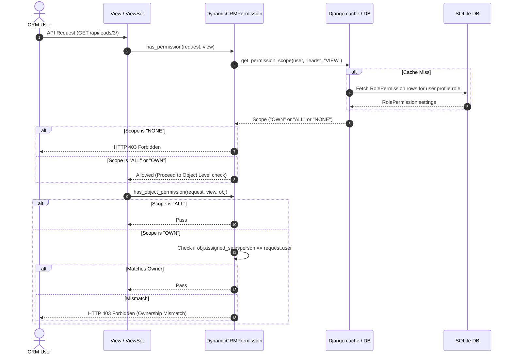
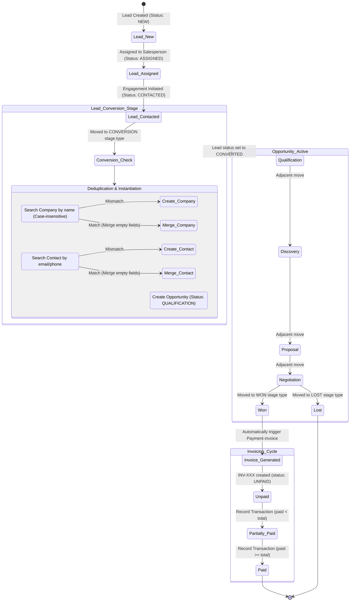

# AdaptCRM - Software Architecture Analysis & Documentation

This document provides a software architect's perspective on the existing implementation, design patterns, access control schemes, data routing, and architectural assumptions of **AdaptCRM**.

---

## 1. System Modules & User Roles Overview

### A. Implemented User Types
The backend distinguishes users along two dimensions:
1. **User Type Classifications (`UserProfile.user_type`)**:
   * **`ADMIN`**: Represents administrative identities. Bypasses row-level scoping filters and sees all corporate data.
   * **`USER`**: Represents standard operators subject to granular row-level data scoping rules.
2. **Access Control Roles (`roles.Role`)**:
   * **`Administrator`**: Full global capability mapping (`ALL` scopes on all actions).
   * **`Manager`**: Global view/management capabilities on active pipeline boards and dashboard metrics, but restricted from modifying system roles.
   * **`Salesperson`**: Restricted data ownership. Operates with `'OWN'` row-level permissions (can only access records where `assigned_salesperson = current_user`).

---

### B. Module Matrix & Accessibility
All applications registered in the CRM are mapped as `CRMResource` entries. These modules are classified by accessibility:

| Module / Resource | Admin Responsibility | CRM User (Manager) | CRM User (Salesperson) |
| :--- | :--- | :--- | :--- |
| **`roles`** | Full CRUD of Role/Permissions matrix. | Access Denied. | Access Denied. |
| **`pipeline` (Config)** | Configure pipelines, stages, won/lost behaviors, and custom form fields. | View and Edit configurations. | View only (GET allowed). |
| **`pipeline` (Board)** | Move any card; view all cards. | Move any card; view all cards. | Move `OWN` assigned cards only; closed cards locked. |
| **`leads`** | Global CRUD, assign to salesperson, convert. | Global CRUD, assign, convert. | CRUD `OWN` leads only; assign restricted; convert `OWN` leads. |
| **`companies`** | Global CRUD. | Global CRUD. | CRUD `OWN` companies only. |
| **`contacts`** | Global CRUD. | Global CRUD. | CRUD `OWN` contacts only (soft deletes). |
| **`opportunities`** | Global CRUD. | Global CRUD. | CRUD `OWN` deals; sequential moves only; closed deals locked. |
| **`payments`** | Global billing view; record any transaction. | Global billing view; record transaction. | CRUD `OWN` invoices; record payment transactions. |
| **`dashboard`** | Global charts, activities, funnels, and metrics. | Global charts, activities, funnels, and metrics. | Scoped summaries (only assigned leads/deals/payments). |

---

## 2. System Flow Diagrams

### A. Overall System Architecture

```mermaid
flowchart TD
    Client[Client Browser / test-client] -->|REST API Requests| Routing[Django URL Dispatcher]
    Routing -->|Match Path| PermGuard{DynamicCRMPermission}
    
    PermGuard -->|Access Denied| HTTP403[HTTP 403 Forbidden]
    PermGuard -->|Access Allowed| View[ViewSet / Class-Based API View]
    
    View -->|Queryset Filtering| QueryScoper[get_scoped_queryset]
    QueryScoper -->|Cache lookup / Role Scope| ScopeResolver[PermissionService]
    ScopeResolver -->|Filter: assigned_salesperson| DB[(SQLite Database)]
    
    View -->|Deserialize & Validate| Serializer[DRF Serializer]
    Serializer -->|validate() validations| ValidationRules[Business Validation Rules]
    ValidationRules -->|Invalid| HTTP400[HTTP 400 Bad Request]
    
    ValidationRules -->|Valid| Service[Workflow / Operations Service]
    Service -->|Atomic DB Transaction| Commit[(SQLite Database)]
    Commit -->|Persisted Object| Response[JSON Envelope API Success]
    Response --> Client
```

---

### B. Role-Based Access Control (RBAC) Flow



---

### C. Lead $\rightarrow$ Opportunity $\rightarrow$ Company $\rightarrow$ Contact $\rightarrow$ Payment Workflow



---

## 3. Core Architectural Subsystems

### A. Authentication Flow
Authentication is managed via standard **Session-based Authentication** using Django and Django REST Framework:
1. **Login (`LoginView` / POST `/api/login/`)**:
   * Accepts `username` and `password`.
   * Invokes Django’s `authenticate()` method to verify credentials.
   * On success, establishes a Django session via `login()`, setting a `sessionid` cookie in the client's browser.
   * Retrieves or instantiates the user's `UserProfile` configuration.
2. **Session Verification (`MeView` / GET `/api/me/`)**:
   * Enforces `IsAuthenticated` check.
   * Extracts user details and profile parameters (`user_type`) from `request.user` session context.
3. **Session Termination (`LogoutView` / POST `/api/logout/`)**:
   * Destroys active session data in the database and clears cookies via `logout()`.

---

### B. Granular Role-Based Access Control (RBAC) Engine
1. **App Registry Discovery**:
   * The `CRMRegistry.discover_resources()` method is run on startup. It scans installed apps, filters out core framework libraries, and registers custom Django apps (like `leads`, `opportunities`) as `CRMResource` database rows.
2. **Dynamic Permission Gatekeeper (`DynamicCRMPermission`)**:
   * Integrates into DRF ViewSets as a base permission class.
   * Maps request methods to permissions actions: `GET` $\rightarrow$ `VIEW`, `POST` $\rightarrow$ `CREATE`, `PUT/PATCH` $\rightarrow$ `EDIT`, `DELETE` $\rightarrow$ `DELETE`. Custom actions map to actions like `EXPORT`, `APPROVE`, and `ASSIGN`.
   * Checks database permission matrices via cached lookup rules.
3. **Queryset Data Scoping (`get_scoped_queryset`)**:
   * Applies filter constraints to queryset operations.
   * If a standard Salesperson is accessing view sets, data tables are filtered dynamically to display only rows where `assigned_salesperson = current_user`. Admins and Managers bypass this constraint and receive unrestricted access.

---

### C. Dashboard Metrics Compiler (`DashboardService`)
The dashboard aggregates metrics dynamically based on the current user's security context:
* **Metrics compiled**: Lead conversion rates, average deal size, total funnel value, active deal counts, won deal revenue, paid/pending/overdue invoice totals.
* **Funnel Stages**: Displays card frequencies and pricing values grouped by `PipelineStage`.
* **Activity Log feed**: Merges recently updated records across Leads, Opportunities, Companies, and Transactions, sorted chronologically.
* **Scoping**: All computations apply `_get_scoped_queryset`, ensuring salespeople only see summaries computed from their own data.

---

## 4. High-Level User Journeys

### Journey 1: Lead Ingestion & Qualification (Salesperson)
```
[Ingest Lead details] 
       │
       ▼
[Assigned Salesperson (Admin action)] 
       │
       ▼
[Perform follow-ups & log attempts] 
       │
       ▼
[Drag-and-drop Lead to CONVERSION stage on Kanban board]
       │
       ▼
[System triggers conversion: creates Company & Contact; creates Opportunity]
```

### Journey 2: Deal Negotiation to Billing (Salesperson)
```
[Select Opportunity card on Pipeline board]
       │
       ▼
[Progress Opportunity sequentially (Qualification -> Discovery -> Proposal)]
       │
       ▼
[Close deal: drag card to CLOSED WON]
       │
       ▼
[System triggers invoice creation (INV-XXX) with unpaid balance]
       │
       ▼
[Record transaction receipts as customer payments come in]
```

### Journey 3: Administrative Access & Board Customization (Administrator)
```
[Authenticate as Administrator]
       │
       ▼
[Navigate to roles.html / pipeline-settings.html]
       │
       ▼
[Edit permissions scope matrix for 'Salesperson' role]
       │
       ▼
[Configure new Pipeline stage definitions and specify won/lost mapping]
```
