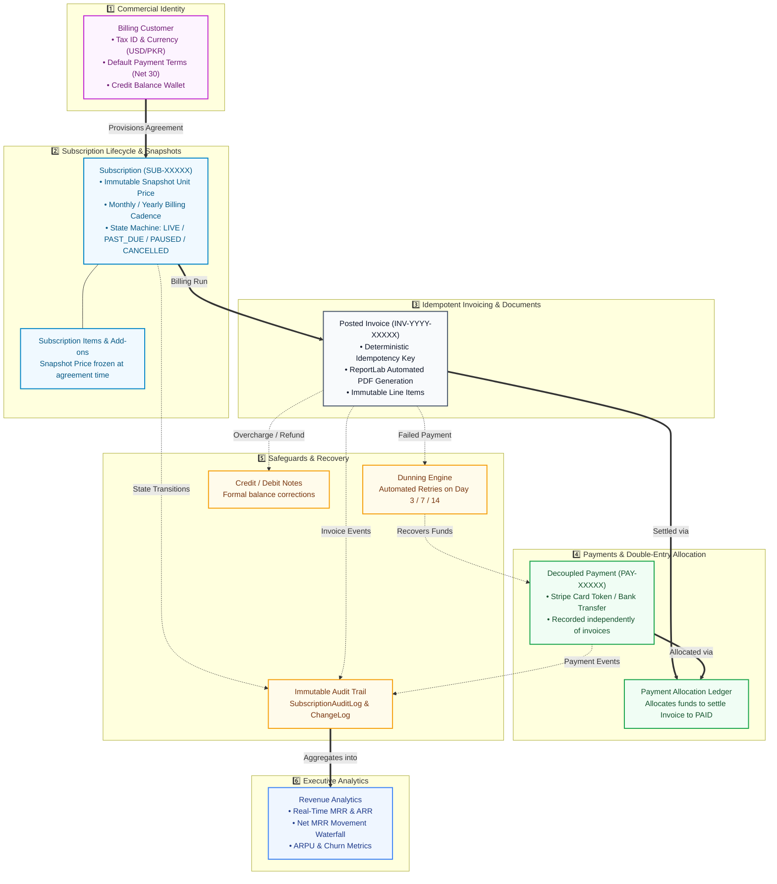

# AdaptCRM — Unified Multi-Tenant CRM, Job Tracking & Standalone Billing Engine

[](https://www.python.org/)
[](https://www.djangoproject.com/)
[](https://www.django-rest-framework.org/)
[]()
[-brightgreen.svg)]()

AdaptCRM is an enterprise-grade, multi-tenant Customer Relationship Management (CRM) platform seamlessly integrated with an operational **Job Tracking System (JTS)** and a decoupled **Standalone Commercial Billing & Subscription Engine**.

---

## 📑 Table of Contents
- [1. System Architecture Diagrams](#1-system-architecture-diagrams)
  - [Complete Platform Ecosystem Architecture](#11-complete-platform-ecosystem-architecture)
  - [CRM Sales Pipeline Architecture](#12-crm-sales-pipeline-architecture)
  - [Standalone Commercial Billing Engine Architecture](#13-standalone-commercial-billing-engine-architecture)
- [2. Core Platform Capabilities](#2-core-platform-capabilities)
- [3. Application Modules & Architecture](#3-application-modules--architecture)
- [4. Centralized Dynamic RBAC & 5 Granular Billing Resources](#4-centralized-dynamic-rbac--5-granular-billing-resources)
- [5. Financial Integrity & Architectural Invariants](#5-financial-integrity--architectural-invariants)
- [6. API Surface & Endpoint Reference](#6-api-surface--endpoint-reference)
- [7. Installation & Quickstart](#7-installation--quickstart)
- [8. Testing & Verification](#8-testing--verification)

---

## 1. System Architecture Diagrams

### 1.1 Complete Platform Ecosystem Architecture
This diagram illustrates the full ecosystem uniting **Multi-Tenant Foundation & RBAC**, the **JTS Service Portal**, the **CRM Sales Pipeline**, and the **Standalone Commercial Billing Engine**:

```mermaid
flowchart TD
    %% ==========================================
    %% 1. MULTI-TENANT IDENTITY & SECURITY FOUNDATION
    %% ==========================================
    subgraph CoreFoundation ["🛡️ 1. MULTI-TENANT IDENTITY, AUTH & RBAC FOUNDATION"]
        TENANT["🏢 Multi-Tenant Isolation Engine (accounts.Organization)<br/>Data strictly isolated per tenant organization"]
        RBAC["🔐 Centralized Dynamic RBAC (roles App)<br/>• 3-Tier Scope Control (ALL / OWN / NONE) &bull; Dynamic Custom Resources<br/>• 5 Independent Billing Resources (Analytics, Customers, Subs, Invoices, Payments)"]
        IDENTITY["👥 Unified Identity & User Routing<br/>• CRM Admin &bull; Salesperson / Manager &bull; JTS Organization Owner &bull; Client"]
    end

    %% ==========================================
    %% 2. JTS (JOB TRACKING SYSTEM) & SERVICE PORTAL
    %% ==========================================
    subgraph JtsDomain ["🛠️ 2. JTS CLIENT PORTAL & JOB TRACKING"]
        direction TB
        JTS_PUB["🌐 Public Catalog & Registration<br/><small>Landing, Service Details, CNIC/Org Verification</small>"]
        JTS_USER["📋 Client Portal (User Dashboard)<br/><small>Service Applications, Document Uploads, Job Tracking</small>"]
        JTS_ADMIN["⚙️ JTS Admin Operations<br/><small>Application Review, Job Fulfillment, Catalog Admin</small>"]
        JTS_PUB --> JTS_USER
        JTS_USER <--> JTS_ADMIN
    end

    %% ==========================================
    %% 3. CRM SALES & RELATIONSHIP ENGINE
    %% ==========================================
    subgraph CrmDomain ["🎯 3. CRM SALES & PIPELINE LIFECYCLE"]
        direction TB
        CATALOG["📦 Product & Service Catalog<br/><small>Catalog SKUs, Pricing, Tiers, Add-ons</small>"]
        LEAD["1️⃣ Leads Module<br/><small>Inbound Prospect Capture & Outreach</small>"]
        PIPE["2️⃣ Pipeline Engine<br/><small>Standard vs Custom Kanban Stages</small>"]
        
        subgraph ConvertedTriad ["🗂️ Auto-Linked Business Profiles"]
            COMP["🏢 Companies"]
            CONT["👤 Contacts"]
            OPP["💼 Opportunities"]
        end

        WON["3️⃣ Closed Won Deal<br/><small>Sales Target Reached</small>"]

        LEAD --> PIPE
        PIPE ==>|Drop in Confirm Stage| ConvertedTriad
        CATALOG -.->|Price & Items| OPP
        ConvertedTriad ==>|Proposal ➔ Negotiation| WON
    end

    %% ==========================================
    %% 4. STANDALONE BILLING & SUBSCRIPTION SYSTEM
    %% ==========================================
    subgraph BillingDomain ["💳 4. STANDALONE COMMERCIAL BILLING ENGINE"]
        direction TB
        BCUST["4️⃣ Billing Customer<br/><small>Currency, Tax ID, Billing Address, Wallet</small>"]
        BSUB["5️⃣ Subscription Agreement<br/><small>Snapshot Pricing, Auto-Renew, Terms</small>"]
        BINV["6️⃣ Invoices & PDF<br/><small>Immutable Posted Bills, Line Items</small>"]
        BPAY["7️⃣ Payments & Allocations<br/><small>Decoupled Cash, Double-Entry Allocations</small>"]
        
        subgraph BillingSafeguards ["🛡️ Financial Safeguards & Lifecycle"]
            DUN["⚠️ Dunning Engine (Retries: Day 3/7/14)"]
            ADJ["📝 Credit / Debit Notes (Adjustments)"]
            ENT["🔑 Entitlements Engine (Feature Gating)"]
        end

        BCUST ==>|Signs Agreement| BSUB
        BSUB ==>|Periodic Billing Run| BINV
        BINV ==>|Settled via| BPAY
        BINV -.->|Failed Card| DUN
        DUN -.->|Recovers| BPAY
        BINV -.->|Refund/Overcharge| ADJ
        BSUB -.->|Gives Access| ENT
    end

    %% ==========================================
    %% 5. POST-SALES & CUSTOMER SUCCESS
    %% ==========================================
    subgraph SupportDomain ["🎧 5. POST-SALES SUPPORT & RETENTION"]
        SUPP["🎫 Support Ticketing System<br/><small>Client Inquiries, SLA Management, Issue Resolution</small>"]
    end

    %% ==========================================
    %% 6. EXECUTIVE ANALYTICS & INTELLIGENCE
    %% ==========================================
    subgraph AnalyticsDomain ["📊 6. EXECUTIVE ANALYTICS & REPORTING"]
        DASH["📈 CRM Sales Dashboard & Leaderboards"]
        UREP["👥 User Performance & Rep Win Rates"]
        BREP["💰 Revenue Analytics & MRR Movement Waterfall"]
    end

    %% Cross-Domain Bridges
    CoreFoundation ==>|Enforces Isolation & RBAC| JtsDomain
    CoreFoundation ==>|Enforces Isolation & RBAC| CrmDomain
    CoreFoundation ==>|Enforces Isolation & RBAC| BillingDomain
    CoreFoundation ==>|Enforces Isolation & RBAC| SupportDomain
    CoreFoundation ==>|Enforces Isolation & RBAC| AnalyticsDomain

    JtsDomain <==|Service Inquiries| CrmDomain
    WON ==>|💳 Convert to Subscription| BCUST
    COMP -.->|Linked Account| SUPP
    BSUB -.->|Account Standing| SUPP

    CrmDomain -.->|Deals & Funnel| DASH
    CrmDomain -.->|Rep Productivity| UREP
    BillingDomain -.->|MRR, ARR, Cash| BREP

    classDef foundationStyle fill:#0f172a,stroke:#6366f1,stroke-width:2px,color:#ffffff;
    classDef jtsStyle fill:#fef3c7,stroke:#d97706,stroke-width:2px,color:#78350f;
    classDef crmStyle fill:#f0f9ff,stroke:#0284c7,stroke-width:2px,color:#0c4a6e;
    classDef billingStyle fill:#fdf4ff,stroke:#a855f7,stroke-width:2px,color:#581c87;
    classDef financeStyle fill:#f0fdf4,stroke:#16a34a,stroke-width:2px,color:#14532d;
    classDef supportStyle fill:#fff1f2,stroke:#f43f5e,stroke-width:2px,color:#881337;
    classDef analyticsStyle fill:#eff6ff,stroke:#3b82f6,stroke-width:2px,color:#1e3a8a;

    class CoreFoundation,TENANT,RBAC,IDENTITY foundationStyle;
    class JtsDomain,JTS_PUB,JTS_USER,JTS_ADMIN jtsStyle;
    class CrmDomain,CATALOG,LEAD,PIPE,COMP,CONT,OPP,WON crmStyle;
    class BillingDomain,BCUST,BSUB,BillingSafeguards,DUN,ADJ,ENT billingStyle;
    class BINV,BPAY financeStyle;
    class SupportDomain,SUPP supportStyle;
    class AnalyticsDomain,DASH,UREP,BREP analyticsStyle;
```

---

### 1.2 CRM Sales Pipeline Architecture
This diagram outlines the complete front-office sales workflow from inbound prospect ingestion through Kanban deal qualification and automatic record linking:

```mermaid
flowchart LR
    subgraph Ingestion ["1️⃣ Inbound Intake"]
        L_WEB["Website Inquiry"]
        L_MAN["Manual Entry"]
        L_REF["Partner Referral"]
    end

    subgraph LeadsModule ["2️⃣ Lead Qualification"]
        LEAD["Leads Engine<br/>• Priority (High/Med/Low)<br/>• Assigned Salesperson<br/>• Standard / Custom Pipeline"]
    end

    subgraph PipelineEngine ["3️⃣ Pipeline Kanban Board"]
        ST_NEW["New"]
        ST_CONT["Contacted"]
        ST_CONF["Confirm / Qualify"]
    end

    subgraph ConversionModal ["4️⃣ Auto-Link Conversion Engine"]
        MODAL["Unified Conversion Modal<br/>Auto-provisions linked triad:"]
        COMP["🏢 Company Profile"]
        CONT["👤 Contact Profile"]
        OPP["💼 Opportunity Deal"]
    end

    subgraph DealClosing ["5️⃣ Opportunity Progression"]
        D_PROP["Proposal Sent"]
        D_NEG["Negotiation"]
        D_WON["🏆 Closed Won"]
    end

    Ingestion --> LEAD
    LEAD --> ST_NEW
    ST_NEW --> ST_CONT
    ST_CONT --> ST_CONF
    ST_CONF ==>|Trigger Conversion| MODAL
    MODAL --> COMP
    MODAL --> CONT
    MODAL --> OPP
    OPP --> D_PROP
    D_PROP --> D_NEG
    D_NEG --> D_WON

    classDef leadStyle fill:#f8fafc,stroke:#64748b,stroke-width:2px,color:#0f172a;
    classDef modalStyle fill:#eff6ff,stroke:#3b82f6,stroke-width:2px,color:#1e3a8a;
    classDef triadStyle fill:#f0fdf4,stroke:#22c55e,stroke-width:2px,color:#14532d;
    classDef wonStyle fill:#ecfdf5,stroke:#059669,stroke-width:3px,color:#065f46;

    class L_WEB,L_MAN,L_REF,LEAD,ST_NEW,ST_CONT,ST_CONF leadStyle;
    class MODAL,D_PROP,D_NEG modalStyle;
    class COMP,CONT,OPP triadStyle;
    class D_WON wonStyle;
```



---

### 1.3 Standalone Commercial Billing Engine Architecture
This diagram depicts the decoupled commercial billing engine, showcasing pricing snapshots, automated invoicing, decoupled payments, dunning recovery, and revenue intelligence:



---

## 2. Core Platform Capabilities

1. **Multi-Tenancy & Data Isolation (`accounts.Organization`)**: Every database query is strictly filtered by tenant organization for authenticated non-staff users.
2. **Centralized Dynamic RBAC (`roles`)**: Complete permission matrix based on **Resource**, **Action** (`VIEW`, `CREATE`, `EDIT`, `DELETE`, `EXPORT`, `ASSIGN`), and **Scope** (`ALL`, `OWN`, `NONE`).
3. **Decoupled Commercial Architecture**: CRM manages relationships, pipelines, and deals; Standalone Billing manages subscriptions, invoices, and payments without importing CRM domain apps.
4. **Frozen Pricing Snapshots**: Subscription item prices are frozen at creation (`SubscriptionItem.unit_price`), ensuring catalog updates never alter existing contracts.
5. **Legally Immutable Invoicing**: Once posted, invoice line items and totals cannot be altered; corrections require formal `CreditNote` or `DebitNote` records.
6. **Automated Dunning Recovery**: Smart retry schedule on **Day 3, Day 7, and Day 14** automatically recovers failed subscription payments.
7. **Executive Real-Time Analytics**: Live computation of Monthly Recurring Revenue (MRR), Annual Recurring Revenue (ARR), ARPU, and MRR Waterfall growth.

---

## 3. Application Modules & Architecture

```
JWTCRM-Backend/
├── accounts/           ──► Multi-tenant Organization, User profiles, CNIC verification, JWT Auth
├── billing/            ──► Standalone Billing Engine (Customers, Subscriptions, Invoices, Payments, Dunning, Analytics)
├── catalog/            ──► Master catalog of products, services, pricing plans, and feedback
├── companies/          ──► Corporate accounts linked to contacts and opportunities
├── config/             ──► Project settings, middleware, and master URL routing
├── contacts/           ──► Individual stakeholder records
├── dashboard/          ──► Sales dashboards, pipeline funnel, team leaderboards, and PDF reporting
├── leads/              ──► Inbound prospect capture, qualification, and communication timeline
├── opportunities/      ──► Commercial deals, value scoping, and "Convert to Subscription" action
├── payments/           ──► Legacy CRM milestone payments (/api/payments/)
├── pipeline/           ──► Dynamic Standard & Custom Kanban pipelines and stage reordering
├── roles/              ──► Centralized dynamic RBAC, custom resources registry, and permission engine
└── support/            ──► Customer ticketing, issue management, and resolution workflows
```

---

## 4. Centralized Dynamic RBAC & 5 Granular Billing Resources

The RBAC system defines three permission scopes:
- **`ALL`**: User can access all organization records.
- **`OWN`**: User can access only records assigned to or created by them (`metadata__created_by_id=user.id`).
- **`NONE`**: Access blocked across both API and UI.

### The 5 Granular Billing Resources
Billing access is split into 5 independently configurable resources:
1. `billing_analytics` — Revenue Analytics dashboard (MRR, ARR, Waterfall).
2. `billing_customers` — Commercial customer account records and credit wallet.
3. `billing_subscriptions` — Subscription agreements, plan items, and lifecycle actions.
4. `billing_invoices` — Posted invoice records, line item calculations, and PDF generation.
5. `billing_payments` — Payments ledger and double-entry invoice allocations.

---

## 5. Financial Integrity & Architectural Invariants

- **Decimal Precision**: All monetary values use `Decimal` with `'0.01'` precision. Floating-point arithmetic is strictly forbidden.
- **Decoupled Payments**: Payments represent actual collected funds and are stored independently from invoices.
- **Double-Entry Allocation**: The binding between payments and invoices exists exclusively through `PaymentAllocation` records.
- **Deterministic Idempotency**: Invoicing runs enforce unique deterministic keys (`inv_sub_<id>_period_<date>`) to prevent duplicate billing.
- **Server-Side Authoritative Math**: All calculations (taxes, discounts, prorations, allocations) occur strictly on the backend.

---

## 6. API Surface & Endpoint Reference

### Authentication & Tenant Accounts
| Method | Endpoint | Description |
| :--- | :--- | :--- |
| `POST` | `/api/login/` | Authenticate user and issue session token |
| `GET` | `/api/me/` | Retrieve authenticated user profile, roles, and permissions |
| `POST` | `/api/register/` | Register new organization and owner account |
| `POST` | `/api/logout/` | Terminate user session |

### CRM Core Modules
| Method | Endpoint | Description |
| :--- | :--- | :--- |
| `GET / POST` | `/api/leads/` | List and create inbound leads |
| `GET / POST` | `/api/pipeline/` | Manage pipelines and Kanban stages |
| `GET / POST` | `/api/companies/` | List and create company profiles |
| `GET / POST` | `/api/contacts/` | List and create contact profiles |
| `GET / POST` | `/api/opportunities/` | Manage deals and sales stages |
| `POST` | `/api/opportunities/<id>/convert-to-subscription/` | Provision commercial subscription from won deal |
| `GET` | `/api/dashboard/summary/` | Retrieve company-wide sales KPIs |

### Standalone Commercial Billing (`/api/v1/billing/`)
| Method | Endpoint | Description |
| :--- | :--- | :--- |
| `GET / POST` | `/api/v1/billing/customers/` | Manage commercial billing customers |
| `GET / POST` | `/api/v1/billing/subscriptions/` | Manage subscriptions and terms |
| `POST` | `/api/v1/billing/subscriptions/<id>/transition/` | State machine transition (Activate, Pause, Cancel, Renew) |
| `POST` | `/api/v1/billing/subscriptions/<id>/amend/` | Subscription plan amendment & proration preview |
| `GET / POST` | `/api/v1/billing/invoices/` | List and generate posted invoices |
| `GET` | `/api/v1/billing/invoices/<id>/pdf/` | Stream branded PDF invoice document |
| `GET / POST` | `/api/v1/billing/payments/` | Record collected payments |
| `POST` | `/api/v1/billing/payments/<id>/allocate/` | Allocate payment to open invoices |
| `GET / POST` | `/api/v1/billing/credit-notes/` | Manage credit note balance adjustments |
| `GET` | `/api/v1/billing/analytics/overview/` | Real-time MRR, ARR, and subscriber metrics |
| `GET` | `/api/v1/billing/analytics/mrr-movement/` | Net MRR waterfall growth breakdown |
| `POST` | `/api/v1/billing/webhooks/stripe/` | Process asynchronous Stripe webhook events |

---

## 7. Installation & Quickstart

### Prerequisites
- **Python 3.12+** (Python 3.14 compatible)
- **SQLite3** (default) or **PostgreSQL 15+**

### Step-by-Step Setup

1. **Clone the Repository**:
   ```bash
   git clone https://github.com/zaid-mian/crm.git
   cd crm
   ```

2. **Create & Activate Virtual Environment**:
   ```bash
   python -m venv venv
   # On Windows:
   .\venv\Scripts\activate
   # On Linux/macOS:
   source venv/bin/activate
   ```

3. **Install Dependencies**:
   ```bash
   pip install -r requirements.txt
   ```

4. **Configure Environment Variables**:
   Create a local `.env` file in the root directory:
   ```env
   SECRET_KEY=your-secure-django-secret-key
   DEBUG=True
   ALLOWED_HOSTS=localhost,127.0.0.1
   STRIPE_SECRET_KEY=sk_test_your_key
   STRIPE_PUBLISHABLE_KEY=pk_test_your_key
   STRIPE_WEBHOOK_SECRET=whsec_your_secret
   ```

5. **Apply Database Migrations**:
   ```bash
   python manage.py migrate
   ```

6. **Create an Administrator Account**:
   ```bash
   python manage.py createsuperuser
   ```

7. **Run the Development Server**:
   ```bash
   python manage.py runserver 8000
   ```
   The backend API will be live at `http://localhost:8000/`.

---

## 8. Testing & Verification

The repository includes a comprehensive unit and integration test suite covering RBAC, Multi-Tenancy, and all 16 Billing phases.

```bash
# Run system and migration integrity checks
python manage.py check
python manage.py makemigrations --check

# Run Centralized RBAC and Granular Billing Permission tests
python manage.py test roles.tests billing.tests.test_rbac_independence

# Run Core Standalone Billing test suite
python manage.py test billing.tests.test_customers billing.tests.test_subscriptions billing.tests.test_invoicing billing.tests.test_payments billing.tests.test_credit_notes billing.tests.test_analytics
```

**Verification Results:** All 122 targeted tests pass with a 100% success rate.
