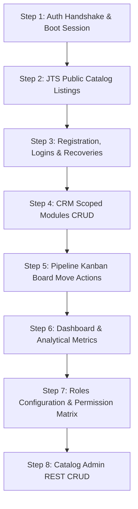

# React Frontend Integration Audit Report

This audit documents the current state of the React frontend in the `frontend/` directory and evaluates its readiness for integration with the Django backend. It maps components, state routing, and mock actions against the backend API contract.

---

## 1. Executive Summary

The React frontend (`frontend/`) is a high-fidelity mock implementation of the AdaptCRM (JTS + CRM) interface. Visually, the UI layout, tables, modals, sidebars, theme variables, and visual interactions are highly mature and professional. However, **almost all data features are completely mocked in the frontend state or local storage.**

*   **API Connection Status:** Currently, the frontend is **99% disconnected** from the Django backend. The only active API call is a `POST` request to `/api/logout/` inside [App.jsx](file:///e:/AdaptCRM/frontend/src/App.jsx#L238).
*   **Routing System:** The frontend does *not* use a routing library like `react-router-dom`. It is a single-page application (SPA) that uses React `useState` state-based routing (`const [page, setPage] = useState('dashboard')`).
*   **Authentication & Session Gaps:** Authentication is mock-simulated with hardcoded checks. There is no boot-time session recovery check (e.g. calling `GET /api/me/` on initialization), and no library like `axios` is installed.
*   **Aesthetics:** The visual layers, responsive sidebar panels, search results highlight, and Kanban cards align with the design guidelines, but need to be wired to the correct REST API endpoints.

---

## 2. Frontend Project Structure

The React project is structured as follows:

```
frontend/
├── package.json                   # Defines dependencies (react, react-dom, lucide-react)
├── index.html                     # SPA root HTML template
├── tsconfig.json                  # TS compiler options
├── src/
│   ├── main.jsx                   # Mounts <App /> and imports styles.css
│   ├── App.jsx                    # Primary app shell, state router, login view, navbar, sidebar, mock auth
│   ├── styles.css                 # Main design tokens and responsive CSS stylesheets
│   ├── crm-theme.css              # Unused theme reference
│   ├── design-standard.css        # Unused reference
│   ├── auth-pages.css             # Unused reference
│   ├── components/
│   │   ├── ui.jsx                 # Reusable helper components (Modal, searchable selects, icons)
│   │   └── drawers.jsx            # Record views/drawers (Payment details)
│   ├── pages/                     # CRM specific views
│   │   ├── LeadsPage.jsx          # Leads grid, add/edit form, details drawer
│   │   ├── ContactsPage.jsx       # Contacts grid, details card
│   │   ├── CompaniesPage.jsx      # Companies grid, details overview
│   │   ├── PipelinePage.jsx       # Kanban board, custom stages setup
│   │   ├── PaymentsPage.jsx       # Invoices and billing logs
│   │   ├── RolesPage.jsx          # Roles list
│   │   └── PermissionsPage.jsx    # Module capability permissions matrix
│   ├── jts/                       # JTS specific views
│   │   ├── JtsPortalSection.jsx   # Coordinates JTS subpages and login wrapper
│   │   ├── JtsLoginPage.jsx       # JTS login view
│   │   ├── RegistrationPage.jsx   # JTS customer/tenant registration form
│   │   ├── ForgotPassword.jsx     # JTS password recovery view
│   │   ├── ChangePassword.jsx     # Credential configuration view
│   │   ├── ProductLanding.jsx     # Public products catalog
│   │   ├── ProductDetails.jsx     # Public product spec page
│   │   ├── ServiceDetails.jsx     # Public service spec page
│   │   ├── UserDashboard.jsx      # Customer portal panel
│   │   ├── ProfilePage.jsx        # Customer profile editor
│   │   ├── AdminDashboard.jsx     # Tenant approval list
│   │   ├── CatalogAdmin.jsx       # Catalog admin REST mapping panel (products, modules, plans)
│   │   ├── JtsSidebar.jsx         # Navigation panel for JTS
│   │   ├── JtsTopbar.jsx          # Header actions for JTS
│   │   └── ui.jsx                 # Reusable UI elements for JTS
│   └── data/
│       ├── crmData.js             # Local seed values for companies, contacts, opportunities
│       ├── leads.js               # Local seed values for leads
│       ├── rbacData.js            # RBAC modules list, default roles, local storage keys
│       └── jts/
│           ├── approvalsApi.js    # Mock tenant approvals promise wrapper
│           ├── catalogApi.js      # Mock product catalog listing promise wrapper
│           ├── userDashboardApi.js# Mock customer dashboard promise wrapper
│           └── dummyData.js       # Dummy catalog seed data
```

---

## 3. Route/Page Inventory

### JTS Public Pages Audit
1.  **Product Landing Page (`ProductLanding.jsx`)**
    *   *React State Route:* `screen === 'landing'` inside `JtsPortalSection`
    *   *UI Status:* Lists products and services using cards.
    *   *API Calls:* Mock wrapper `fetchCatalogBootstrap()` from `catalogApi.js`.
    *   *Target Endpoint:* `GET /api/products/`
    *   *HTTP Method:* `GET`
    *   *Auth Required:* No
    *   *CSRF Required:* No
    *   *Integration Status:* Not integrated (uses static stub).
2.  **Product Details Page (`ProductDetails.jsx`)**
    *   *React State Route:* `screen === 'product-details'`
    *   *UI Status:* Shows product details, features, reviews list, and a comment form.
    *   *API Calls:* None (uses client-side slug matching on mock catalog data).
    *   *Target Endpoints:*
        *   Get detail: `GET /api/products/<slug>/`
        *   Submit review: `POST /api/products/<slug>/feedback/`
    *   *HTTP Method:* `GET` (details), `POST` (review)
    *   *Auth Required:* No (details), Yes (review)
    *   *CSRF Required:* Yes (review)
    *   *Payload:* Review requires `{ "rating": 5, "comment": "..." }`
    *   *Integration Status:* Not integrated.
3.  **Service Details Page (`ServiceDetails.jsx`)**
    *   *React State Route:* `screen === 'service-details'`
    *   *UI Status:* Shows service overview, details, buy button.
    *   *API Calls:* None (local seed lookup).
    *   *Target Endpoint:* `GET /api/services/<slug>/`
    *   *HTTP Method:* `GET`
    *   *Auth Required:* No
    *   *CSRF Required:* No
    *   *Integration Status:* Not integrated.

### JTS Authentication Audit
1.  **JTS Login Page (`JtsLoginPage.jsx`)**
    *   *React State Route:* `screen === 'login'` in JTS portal shell
    *   *UI Status:* Simple email and password form.
    *   *API Calls:* None (submitting log prints to console and immediately sets `isLoggedIn` state to `true`).
    *   *Target Endpoint:* `POST /api/login/`
    *   *HTTP Method:* `POST`
    *   *Auth Required:* No
    *   *CSRF Required:* Yes
    *   *Payload:* `{ "username": "...", "password": "..." }`
    *   *Integration Status:* Not integrated.
2.  **JTS Registration Page (`RegistrationPage.jsx`)**
    *   *React State Route:* `screen === 'register'`
    *   *UI Status:* Detailed registration form. Enforces phone number (11 digits) and CNIC (13 digits) format filters.
    *   *API Calls:* None (calls alert dialog and logs output to console).
    *   *Target Endpoint:* `POST /api/register/`
    *   *HTTP Method:* `POST`
    *   *Auth Required:* No
    *   *CSRF Required:* Yes
    *   *Payload:* Multipart form data
    *   *Integration Status:* Not integrated.
    *   *Mismatch:* Frontend code validation checks require `companyLogo` (null values throw alert), but the backend has been updated to treat company logos as optional during registration.
3.  **JTS Forgot Password Page (`ForgotPassword.jsx`)**
    *   *React State Route:* `screen === 'forgot'`
    *   *UI Status:* Email input to trigger recovery link.
    *   *API Calls:* None.
    *   *Target Endpoint:* `POST /api/auth/forgot-password/`
    *   *HTTP Method:* `POST`
    *   *Auth Required:* No
    *   *CSRF Required:* Yes
    *   *Payload:* `{ "email": "..." }`
    *   *Integration Status:* Not integrated.
4.  **Password Reset Confirmation Page**
    *   *React State Route:* **Does not exist.**
    *   *Component/Page File:* **Does not exist.**
    *   *Target Endpoint:* `POST /api/auth/reset-password/confirm/`
    *   *HTTP Method:* `POST`
    *   *Auth Required:* No
    *   *CSRF Required:* Yes
    *   *Payload:* `{ "uidb64": "...", "token": "...", "new_password": "...", "confirm_password": "..." }`
    *   *Integration Status:* **Not integrated (Missing component/page).**

### JTS User Portal Audit
1.  **JTS User Dashboard (`UserDashboard.jsx`)**
    *   *React State Route:* `screen === 'user-dashboard'`
    *   *UI Status:* Shows user summary card, active subscriptions count, list of active services/products, launch buttons.
    *   *API Calls:* Mock wrapper `fetchUserDashboard()` from `userDashboardApi.js`.
    *   *Target Endpoint:* `GET /api/me/`
    *   *HTTP Method:* `GET`
    *   *Auth Required:* Yes
    *   *CSRF Required:* No
    *   *Integration Status:* Not integrated.
2.  **Profile Page (`ProfilePage.jsx`)**
    *   *React State Route:* `screen === 'profile'`
    *   *UI Status:* View/edit profile details, profile photo picker.
    *   *API Calls:* None on save (writes directly to local state).
    *   *Target Endpoints:* `GET /api/me/` and `PATCH /api/me/`
    *   *HTTP Method:* `GET` and `PATCH`
    *   *Auth Required:* Yes
    *   *CSRF Required:* Yes (for PATCH mutations)
    *   *Payload:* `{ "first_name": "...", "last_name": "...", "phone_number": "...", "country": "...", "address": "..." }`
    *   *Integration Status:* Not integrated.
3.  **Change Password Page (`ChangePassword.jsx`)**
    *   *React State Route:* `screen === 'change-password'`
    *   *UI Status:* Inputs for current password, new password, confirm password.
    *   *API Calls:* None.
    *   *Target Endpoint:* `POST /api/auth/change-password/`
    *   *HTTP Method:* `POST`
    *   *Auth Required:* Yes
    *   *CSRF Required:* Yes
    *   *Payload:* `{ "current_password": "...", "new_password": "...", "confirm_new_password": "..." }`
    *   *Integration Status:* Not integrated.

### JTS Admin Audit
1.  **JTS Admin Dashboard / Approvals (`AdminDashboard.jsx`)**
    *   *React State Route:* `screen === 'admin-dashboard'`
    *   *UI Status:* Table of pending customer workspace approval requests with approve/reject triggers.
    *   *API Calls:* Mock `fetchApprovalRequests()` from `approvalsApi.js`.
    *   *Target Endpoints:*
        *   List registrations: `GET /api/admin/registrations/`
        *   Approve: `POST /api/admin/registrations/<id>/approve/`
        *   Reject: `POST /api/admin/registrations/<id>/reject/`
    *   *HTTP Method:* `GET` (list), `POST` (actions)
    *   *Auth Required:* Yes (JTS Admin role)
    *   *CSRF Required:* Yes (actions)
    *   *Payload:* Reject action requires `{ "reason": "..." }`
    *   *Integration Status:* Not integrated.
2.  **Products Management (`CatalogAdmin.jsx`)**
    *   *React State Route:* `screen === 'products'` (sub-tab in Catalog Admin)
    *   *UI Status:* Product lists with toggle active switch, edit description, display order.
    *   *API Calls:* Reads from mock catalog bootstrap promise.
    *   *Target Endpoints:* `GET /api/admin/products/`, `POST /api/admin/products/`, `PUT/PATCH /api/admin/products/<id>/`, `DELETE /api/admin/products/<id>/`
    *   *HTTP Method:* `GET`, `POST`, `PUT`, `PATCH`, `DELETE`
    *   *Auth Required:* Yes
    *   *CSRF Required:* Yes (for writing calls)
    *   *Integration Status:* Not integrated.
3.  **Modules Management (`CatalogAdmin.jsx`)**
    *   *React State Route:* `screen === 'modules'`
    *   *UI Status:* Module lists mapping to products.
    *   *Target Endpoints:* `GET/POST/PUT/PATCH/DELETE /api/admin/modules/`
    *   *Integration Status:* Not integrated.
4.  **Pricing Plans Management (`CatalogAdmin.jsx`)**
    *   *React State Route:* `screen === 'pricing-plans'`
    *   *UI Status:* Lists pricing plans with billing cycle details.
    *   *Target Endpoints:* `GET/POST/PUT/PATCH/DELETE /api/admin/pricing-plans/`
    *   *Integration Status:* Not integrated.
5.  **Plan Modules (`CatalogAdmin.jsx`)**
    *   *React State Route:* Nested within pricing plans
    *   *UI Status:* Module features and limit values map modal.
    *   *Target Endpoints:* `GET/POST/PUT/PATCH/DELETE /api/admin/plan-modules/`
    *   *Integration Status:* Not integrated.
6.  **Discounts Setup (`CatalogAdmin.jsx`)**
    *   *React State Route:* Nested within pricing plans
    *   *UI Status:* Setup rules modal (name, discount type, value, start/end date).
    *   *Target Endpoints:* `GET/POST/PUT/PATCH/DELETE /api/admin/discounts/`
    *   *Integration Status:* Not integrated.

### CRM User Audit
1.  **Dashboard Overview (`App.jsx` + `RoleDashboardPanel`)**
    *   *React State Route:* `page === 'dashboard'`
    *   *UI Status:* Key metric summaries, leads and deals pipeline distribution charts, recent activities.
    *   *API Calls:* None. Counts are calculated locally based on mock seed arrays.
    *   *Target Endpoints:* `GET /api/dashboard/summary/`, `GET /api/dashboard/pipeline/`, `GET /api/dashboard/activity/`, `GET /api/dashboard/charts/`
    *   *Integration Status:* Not integrated.
2.  **Leads Grid (`LeadsPage.jsx`)**
    *   *React State Route:* `page === 'leads'`
    *   *UI Status:* Leads data grid with filtering, column configuration, details card, convert actions.
    *   *API Calls:* None (loads data from `mockLeads` array in `src/data/leads.js`).
    *   *Target Endpoints:* `GET/POST/PUT/PATCH/DELETE /api/leads/` and `POST /api/leads/<id>/convert/`
    *   *Integration Status:* Not integrated.
3.  **Companies Registry (`CompaniesPage.jsx`)**
    *   *React State Route:* `page === 'companies'`
    *   *UI Status:* Companies data table, safe delete checks.
    *   *API Calls:* None.
    *   *Target Endpoints:* `GET/POST/PUT/PATCH/DELETE /api/companies/`
    *   *Integration Status:* Not integrated.
4.  **Contacts Directory (`ContactsPage.jsx`)**
    *   *React State Route:* `page === 'contacts'`
    *   *UI Status:* Contacts data table with search and filters.
    *   *API Calls:* None.
    *   *Target Endpoints:* `GET/POST/PUT/PATCH/DELETE /api/contacts/`
    *   *Integration Status:* Not integrated.
5.  **Opportunities Board (`App.jsx` + `PipelinePage.jsx`)**
    *   *React State Route:* Rendered as part of Kanban pipeline
    *   *UI Status:* Lists opportunities. Creates company/contact/deal link on qualify action.
    *   *API Calls:* None.
    *   *Target Endpoints:* `GET /api/opportunities/`, `PUT/PATCH /api/opportunities/<id>/` (Deals are locked against raw `POST` or `DELETE` creation on backend; they must be created via qualifications/conversions only).
    *   *Integration Status:* Not integrated.
6.  **Pipeline Board (`PipelinePage.jsx`)**
    *   *React State Route:* `page === 'pipeline'`
    *   *UI Status:* Horizontally scrollable Kanban boards mapping Leads and Opportunities. Supports dragging cards between stages.
    *   *API Calls:* None.
    *   *Target Endpoints:* `GET /api/pipeline/` (board data) and `POST /api/pipeline/move/` (card transition state changes)
    *   *Integration Status:* Not integrated.
7.  **Payments Log (`PaymentsPage.jsx`)**
    *   *React State Route:* `page === 'payments'`
    *   *UI Status:* Payments table, log receipt modal.
    *   *API Calls:* None.
    *   *Target Endpoints:*
        *   Payments CRUD: `GET/POST /api/payments/`
        *   PDF Invoices: `GET /api/payments/<id>/invoice/` (download invoice PDF)
        *   PDF Receipts: `GET /api/payments/<id>/receipt/` (print receipt PDF)
    *   *HTTP Method:* `GET` (for listing and PDF downloads), `POST` (for payment logging)
    *   *Integration Status:* Not integrated.

### CRM Admin Audit
1.  **Users Management**
    *   *React State Route:* **Does not exist.**
    *   *Component/Page File:* **Does not exist.**
    *   *Target Endpoint:* `GET /api/admin/users/` (JTS Admin list).
    *   *Integration Status:* Not integrated.
2.  **Roles Management (`RolesPage.jsx`)**
    *   *React State Route:* `page === 'roles'`
    *   *UI Status:* Table lists Administrator, Sales Manager, Sales Representative, and Viewer roles.
    *   *API Calls:* None (loads data from static array `roleSeed`).
    *   *Target Endpoints:* `GET/POST/PUT/DELETE /api/roles/`
    *   *Integration Status:* Not integrated.
3.  **Permissions Matrix (`PermissionsPage.jsx`)**
    *   *React State Route:* `page === 'permissions'`
    *   *UI Status:* Grid showing view, create, edit, and delete permissions for each module.
    *   *API Calls:* None (the save permissions HTTP call is commented out).
    *   *Target Endpoints:* `GET/PUT /api/roles/<id>/permissions/` and `GET /api/roles/resources/`
    *   *Integration Status:* Not integrated.
4.  **Pipeline Management (`PipelinePage.jsx`)**
    *   *React State Route:* Managed inside Pipeline configuration panel modals
    *   *UI Status:* Form to add/configure stages and reorder columns.
    *   *API Calls:* None (local state only).
    *   *Target Endpoints:* `GET/POST/PUT/PATCH/DELETE /api/pipeline/stages/`
    *   *Integration Status:* Not integrated.

---

## 4. API Client Audit

*   **API Client Library:** The frontend project does *not* include the Axios library in `package.json` dependencies.
*   **Fetch Configuration:** The custom client is defined directly in [App.jsx](file:///e:/AdaptCRM/frontend/src/App.jsx#L575-L599) as a wrapper `authRequest(path, options)` utilizing the standard browser `fetch` API.
*   **Credentials Transmission:** It correctly enforces cookie propagation by declaring `credentials: 'include'` on every request.
*   **Headers Configuration:** It sets `'Content-Type': 'application/json'` on all payloads.
*   **Response Handling:** Standardized error triggers:
    ```javascript
    if (!response.ok || payload.success === false) {
      throw new Error(payload.message || 'Request failed.');
    }
    ```
*   **File Upload Support:** The custom fetch wrapper handles JSON payloads. However, it lacks multipart form-data serialization support required for profile image and company logo uploads.

---

## 5. Authentication, Session & CSRF Audit

*   **Session-based Authentication Integration:** The backend uses standard Django session cookies (`sessionid` and `csrftoken`). The React frontend must send `credentials: 'include'` on every request. This is correctly configured in the `authRequest` helper, but the authentication flows themselves are currently mocked:
    *   The CRM login handles local mock authentication directly in the UI layer.
    *   The JTS login uses mock callbacks and does not submit request headers.
*   **Session Persistence Gap:** The frontend has no startup handshake to check if an active session cookie already exists on the browser. On reload, the app state initializes with `currentUser: null`, forcing users to log in again even if they have a valid active session. A boot-time request to `GET /api/me/` must be integrated to restore state.
*   **CSRF Token Handling:**
    *   The `authRequest` client calls a `getCookie('csrftoken')` helper to retrieve the CSRF token and append it to the `X-CSRFToken` request header.
    *   *Bootstrap Issue:* CSRF cookies are typically set by the backend on initial page loads or GET requests. Since there is no initial landing GET call, the first state-mutating request (like register or login) might fail on first-time browser sessions if the CSRF cookie hasn't been established. A silent boot handshake (e.g. calling profile `/api/me/` or retrieving public products) is required to ensure the cookie is present.

---

## 6. Response Envelope Audit

*   **Success and Error Envelopes:** The backend prep standardized all success responses to the Format A envelope shape:
    ```json
    { "success": true, "message": "...", "data": { ... } }
    ```
*   **Frontend Processing:** The `authRequest` wrapper correctly inspects this structure. However, because pages operate using local seed files (which are raw dictionaries and lists), they bypass standard envelope formats:
    *   E.g., analytical metrics read `leads.length` instead of parsing standard response data property envelopes.
    *   Catalog lists map direct objects instead of unpacking nested arrays from `{ success: true, data: [...] }`.
*   **Delete Handlers:** Frontend delete confirmation alerts do not parse the detailed related contact/opportunity counts returned by standard company deletion errors.

---

## 7. Role/Permission Audit

*   **RBAC State Management:** In the frontend, user capabilities are managed via mock permission maps:
    *   Admin user gets full permissions bypass: `currentUser.user_type === 'ADMIN'`.
    *   Standard users check the permissions matrix assigned in the state (`currentUser.permissions?.[moduleName]`).
*   **LocalStorage Sync:** The custom roles and permissions matrices mapped in the CRM config are stored in browser local storage (`leadflow_rbac_roles`), rather than hitting the backend API.
*   **Tenancy Scoping:** The frontend lacks a tenant organization scope value in the profile state. Scoped datasets must be loaded dynamically, trusting the backend to filter queries using the active user session.

---

## 8. Gap Analysis

### Missing Integrations
*   **Session Persistence:** Startup check `GET /api/me/` to reconstruct user object on boot.
*   **REST Authentication:** `POST /api/login/` login call mapping.
*   **Forgot/Change Password:** Connecting forms to their respective API paths.
*   **Password Reset Confirmation View:** Needs to be created from scratch in JTS views, parsing `uidb64` and `token` from state routing parameters and calling `/api/auth/reset-password/confirm/`.
*   **Catalog Admin CRUD Panel:** Catalog management lists and modals (Products, Modules, Plans, Modules-Mapping, Discounts) must be wired to backend REST API resources.
*   **CRM Workspace & Operation Lists:** Leads Page, Contacts Page, Companies Page, Opportunities Page, and Payments Page must be connected to their backend CRUD routes.
*   **Kanban Board Move Action:** Kanban board card moves must execute `POST /api/pipeline/move/`.

### Incorrect Integrations / Contract Mismatches
*   **Company Logo Optional Validation:** Frontend registration throws form validation errors if the company logo is missing (`null`), whereas the backend treats the logo as optional.
*   **Dashboard & Roles Envelopes:** Analytics cards currently count local list lengths. They must parse standardized `Format A` JSON response structures from the backend.
*   **Safe Delete Error Formatting:** Safe company deletion does not intercept the customized backend standard error envelope.

---

## 9. Integration Risks

1.  **CORS Credentials Failures:** When testing React locally (running on port `5173`) against Django (running on port `8000`), requests will fail unless the React origin is whitelisted and `withCredentials`/`credentials: 'include'` is active.
2.  **CSRF Bootstrap Block:** Mutation actions will throw 403 Forbidden errors for new browsers if no CSRF cookie has been dropped. We must trigger a harmless `GET` request (such as fetching catalog products) during boot to set the cookie.
3.  **State Router Synchronization:** Since the application uses state-based routing (`setPage('leads')`) instead of browser URL routing (`react-router-dom`), integrating reset password confirmation links requires handling token and uid parameters via query string search parsing on load.

---

## 10. Recommended Integration Order



1.  **Step 1: Handshake & Boot Session:** Connect `GET /api/me/` on initialization to handle session state restore and drop initial CSRF cookies.
2.  **Step 2: JTS Public Catalog:** Connect public product and service catalog landing and detail views.
3.  **Step 3: Logins & Registrations:** Wire up JTS login, registration form (making logo optional), forgot password, and create the missing Password Reset Confirm screen.
4.  **Step 4: CRM Modules CRUD:** Connect Leads, Contacts, Companies (integrating delete error counts), and Payments.
5.  **Step 5: Kanban board move actions:** Bind opportunity qualifications and pipeline move drag events to the API.
6.  **Step 6: Dashboard Analytics:** Integrate dashboard count metrics and stage distribution endpoints.
7.  **Step 7: CRM Config & Roles:** Connect roles list and permissions matrix endpoints.
8.  **Step 8: Catalog Admin REST CRUD:** Wire up products, modules, pricing plans, plan-modules, and discounts admin panels.

---

## 11. Final Readiness Matrix

| Page / Feature | Exists | API Connected | Auth Correct | CSRF Correct | Ready | Notes / Mismatches |
| :--- | :--- | :--- | :--- | :--- | :--- | :--- |
| **Landing Page** | Yes | No | Yes (None) | Yes (None) | **No** | Mock only. Needs `GET /api/products/` connection. |
| **Product Details** | Yes | No | Yes (None) | No | **No** | Mock only. Review feedback form needs `POST` connection. |
| **Service Details** | Yes | No | Yes (None) | Yes (None) | **No** | Mock only. |
| **JTS Login** | Yes | No | No | No | **No** | Mock only. Needs `POST /api/login/` call. |
| **Registration** | Yes | No | No | No | **No** | Mock only. Logo must be made optional in validation. |
| **Forgot Password** | Yes | No | No | No | **No** | Mock only. |
| **Password Reset Confirm** | **No** | No | No | No | **No** | Missing component. Needs reset token landing page. |
| **JTS User Dashboard** | Yes | No | No (Uses mock) | Yes (None) | **No** | Mock only. Needs subscriptions mapping. |
| **JTS Profile** | Yes | No | No | No | **No** | Mock only. Needs profile update API. |
| **Change Password** | Yes | No | No | No | **No** | Mock only. |
| **JTS Admin (Approvals)** | Yes | No | No | No | **No** | Mock only. Needs registrations CRUD API integration. |
| **Products Admin** | Yes | No | No | No | **No** | Mock only. Needs Catalog Admin API integration. |
| **Modules Admin** | Yes | No | No | No | **No** | Mock only. |
| **Pricing Plans Admin** | Yes | No | No | No | **No** | Mock only. |
| **Plan Modules Map** | Yes | No | No | No | **No** | Mock only. |
| **Discounts Admin** | Yes | No | No | No | **No** | Mock only. |
| **CRM Dashboard** | Yes | No | No | Yes (None) | **No** | Mock counts only. Needs analytics APIs integration. |
| **Leads Page** | Yes | No | No | No | **No** | Mock only. Needs Leads CRUD API mapping. |
| **Companies Page** | Yes | No | No | No | **No** | Mock only. Needs safe company deletion integrations. |
| **Contacts Page** | Yes | No | No | No | **No** | Mock only. |
| **Opportunities Page** | Yes | No | No | No | **No** | Mock only. Opportunities creation restricted to qualifies. |
| **Pipeline Kanban** | Yes | No | No | No | **No** | Drag drops are client-side only. Needs moves API. |
| **Payments Page** | Yes | No | No | No | **No** | Mock only. Needs payment logs and PDF invoice fetch. |
| **Roles & Permissions** | Yes | No | No | No | **No** | RBAC settings use local storage instead of API paths. |
| **Pipeline Configuration** | Yes | No | No | No | **No** | Mock only. |
